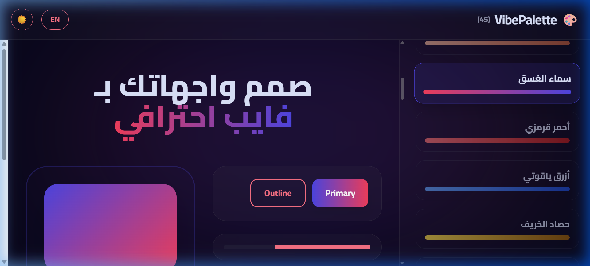
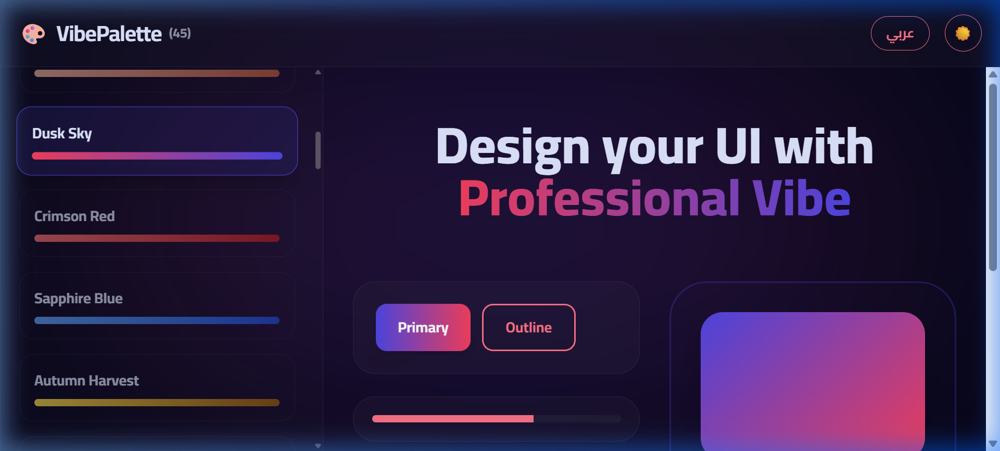
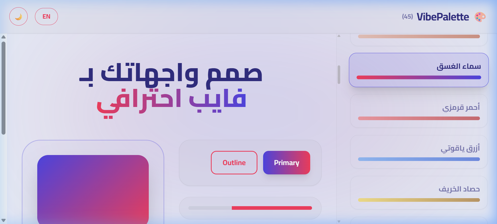
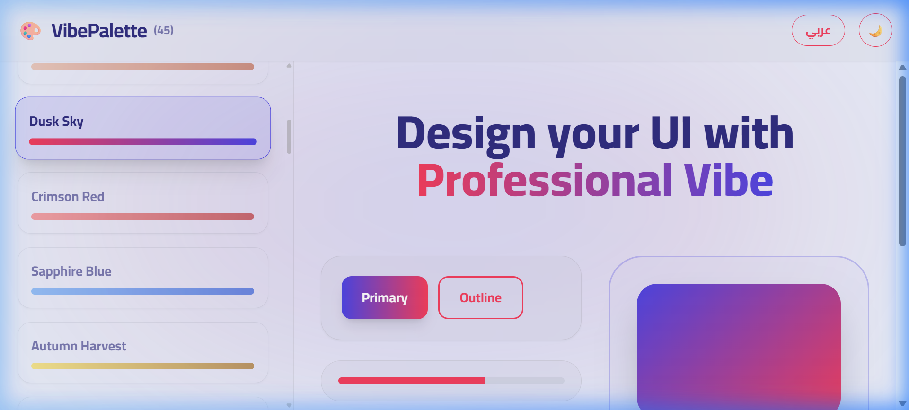

# 🎨 VibePalette

### AI-Ready Color Palettes for Vibe Coders | لوحات ألوان جاهزة للذكاء الاصطناعي

**[🌐 Live Demo](https://bmubook.github.io/VibePalette/)** · **[English](#-english)** · **[العربية](#-العربية)**

---

### 🌙 Dark Mode | الوضع الليلي

  
  

### ☀️ Light Mode | الوضع النهاري

  
  

---

## 🤔 Why VibePalette? | لماذا VibePalette؟

<table>
<tr>
<td align="center">🎯 <b>AI-Ready Prompts</b> برومبتات جاهزة للـ AI</td>
<td align="center">🌗 <b>Light + Dark</b> وضع ليلي + نهاري لكل لوحة</td>
<td align="center">🌐 <b>Bilingual</b> عربي + إنجليزي (RTL/LTR)</td>
<td align="center">📦 <b>Multi-Export</b> CSS · Tailwind · SCSS · JSON</td>
</tr>
<tr>
<td align="center">♿ <b>WCAG Checker</b> فاحص تباين الألوان</td>
<td align="center">🔍 <b>Search & Filter</b> بحث وتصفية سريعة</td>
<td align="center">❤️ <b>Favorites</b> حفظ اللوحات المفضلة</td>
<td align="center">⚡ <b>Zero Dependencies</b> ملف HTML واحد — لا Backend</td>
</tr>
</table>

---

## 🏆 vs Competitors | مقارنة بالمنافسين

| Feature | VibePalette | Coolors | Huemint | ColorMagic |
|---------|:-----------:|:-------:|:-------:|:----------:|
| AI-Ready Prompt | ✅ | ❌ | ❌ | ❌ |
| Light + Dark Mode per palette | ✅ | ❌ | ❌ | ❌ |
| RTL / Arabic Support | ✅ | ❌ | ❌ | ❌ |
| Multi-format Export | ✅ | ✅ | ❌ | ❌ |
| WCAG Contrast Checker | ✅ | ✅ | ❌ | ❌ |
| Offline / No Backend | ✅ | ❌ | ❌ | ❌ |
| Free & Open Source | ✅ | Freemium | ✅ | ✅ |

---

## 🚀 English

**VibePalette** is the world's first AI-ready color palette tool built for **Vibe Coders**. It provides instant, professionally engineered color prompts for Light and Dark modes with a single click.

### ✨ Features
- **45+ Curated Palettes** — Hand-picked tones for modern UIs
- **Smart AI Prompts** — Full architectural guide for AI tools (ChatGPT, Cursor, Lovable, etc.)
- **Multi-Format Export** — CSS Variables · Tailwind Config · SCSS · JSON Design Tokens
- **WCAG Contrast Checker** — Built-in accessibility verification (AA/AAA)
- **Rich Live Preview** — Cards, inputs, navbars, badges — all in real-time
- **Search & Filter** — Find palettes by name or color family
- **Favorites** — Save your best palettes (localStorage)
- **Fully Responsive** — Beautiful on Mobile, Tablet, and Desktop
- **Bilingual** — Arabic (RTL) ↔ English (LTR) seamless switching

### 🤝 Contributing
This project is **Open Source**! Everyone is welcome to:
- Add new color palettes
- Suggest features or improvements
- Fix bugs or optimize performance

**How to contribute:**
1. Fork the project
2. Add your magic
3. Open a Pull Request!

---

## 🚀 العربية

**VibePalette** هي أول أداة ألوان في العالم مُصممة خصيصاً لمطوري الـ **Vibe Coding**. توفر لك برومبتات ألوان هندسية جاهزة للذكاء الاصطناعي تدعم الوضعين (النهاري والليلي) بضغطة زر واحدة.

### ✨ المميزات
- **أكثر من 45 لوحة لونية** — ألوان مُهندسة بعناية للواجهات العصرية
- **برومبتات AI هندسية** — دليل معماري كامل لأدوات الذكاء الاصطناعي
- **تصدير متعدد الصيغ** — CSS Variables · Tailwind · SCSS · JSON Tokens
- **فاحص تباين WCAG** — تحقق فوري من معايير الوصول (AA/AAA)
- **معاينة حية غنية** — بطاقات، حقول إدخال، شريط تنقل، شارات
- **بحث وتصفية** — ابحث بالاسم أو بعائلة الألوان
- **مفضلات** — احفظ لوحاتك المفضلة (بدون تسجيل دخول)
- **تجاوب كامل** — تعمل بشكل مثالي على الجوال والمكتبي
- **ثنائية اللغة** — عربي (RTL) ↔ إنجليزي (LTR) بتبديل فوري

### 🤝 المساهمة
المشروع **مفتوح المصدر**! أرحب بالجميع للمشاركة في:
- إضافة لوحات ألوان جديدة
- اقتراح ميزات أو تحسينات
- إصلاح الأخطاء أو تحسين الأداء

**كيف تشارك؟**
1. اعمل Fork للمشروع
2. أضف لمستك الإبداعية
3. أرسل Pull Request!

---

### ⭐ Support | الدعم

If you find this tool useful, give it a **Star** ⭐ — it means the world!
 
إذا أعجبتك الأداة، اضغط **Star** ⭐ لدعم المشروع!

**Made with ❤️ for the Vibe Coding Community**

