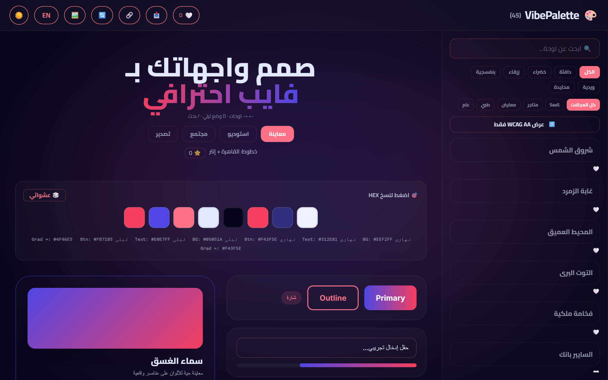
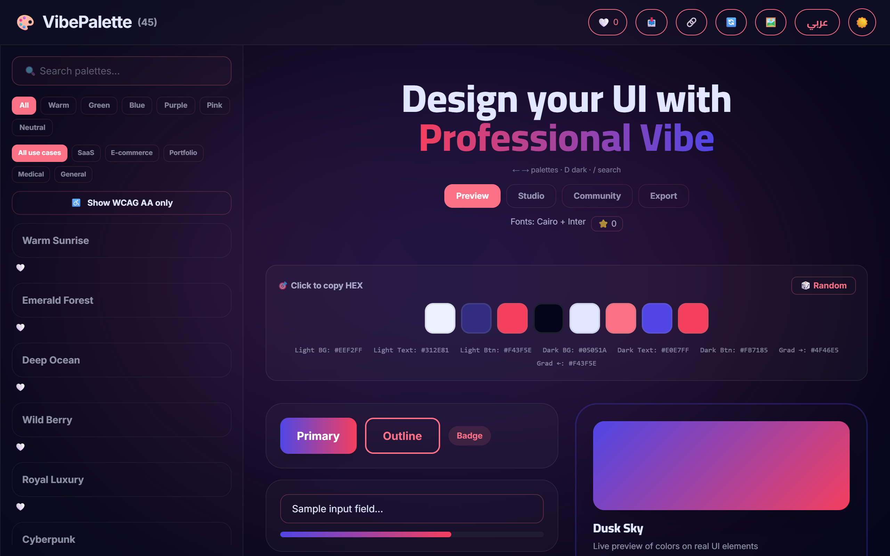
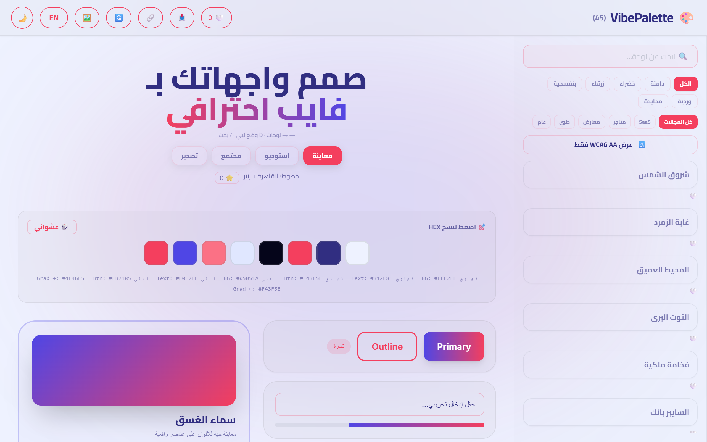
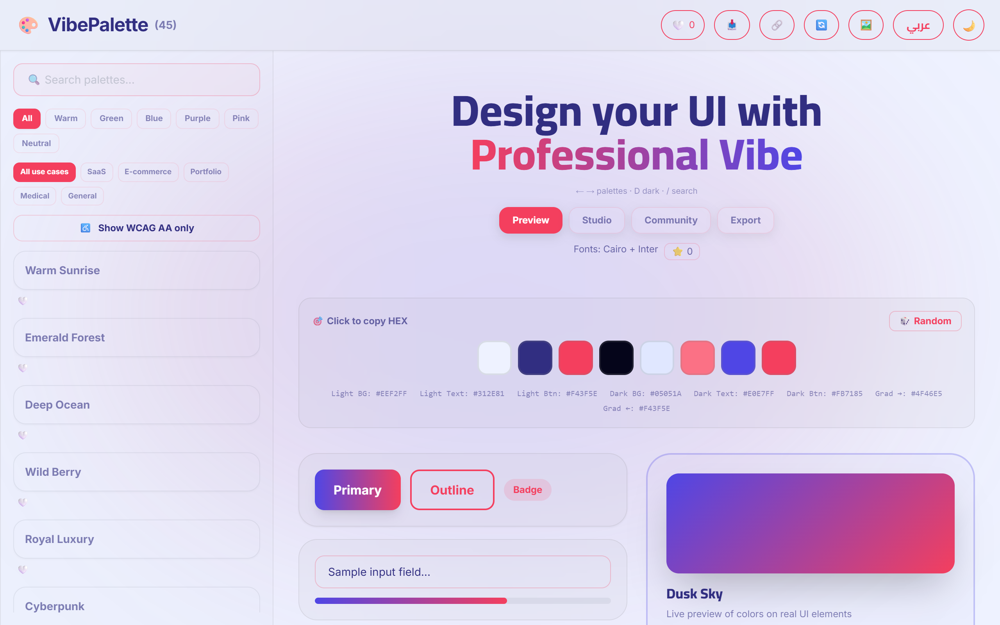

# 🎨 VibePalette

### AI-Ready Color Palettes for Vibe Coders | لوحات ألوان جاهزة للذكاء الاصطناعي

**[🌐 Live Demo](https://bmubook.github.io/VibePalette/)** · **[English](#-english)** · **[العربية](#-العربية)**

---

### 🌙 Dark Mode | الوضع الليلي

  
  

### ☀️ Light Mode | الوضع النهاري

  
  

---

## 🤔 Why VibePalette? | لماذا VibePalette؟

<table>
<tr>
<td align="center">🎯 <b>AI-Ready Prompts</b> برومبتات جاهزة للـ AI</td>
<td align="center">🌗 <b>Light + Dark</b> وضع ليلي + نهاري لكل لوحة</td>
<td align="center">🌐 <b>Bilingual</b> عربي + إنجليزي (RTL/LTR)</td>
<td align="center">📦 <b>Multi-Export</b> CSS · Tailwind · SCSS · JSON</td>
</tr>
<tr>
<td align="center">♿ <b>WCAG Checker</b> فاحص تباين الألوان</td>
<td align="center">🔍 <b>Search & Filter</b> بحث وتصفية سريعة</td>
<td align="center">❤️ <b>Favorites</b> حفظ اللوحات المفضلة</td>
<td align="center">⚡ <b>Zero Dependencies</b> ملف HTML واحد — لا Backend</td>
</tr>
</table>

---

## 🏆 vs Competitors | مقارنة بالمنافسين

| Feature | VibePalette | Coolors | Huemint | ColorMagic |
|---------|:-----------:|:-------:|:-------:|:----------:|
| AI-Ready Prompt | ✅ | ❌ | ❌ | ❌ |
| Light + Dark Mode per palette | ✅ | ❌ | ❌ | ❌ |
| RTL / Arabic Support | ✅ | ❌ | ❌ | ❌ |
| Multi-format Export | ✅ | ✅ | ❌ | ❌ |
| WCAG Contrast Checker & Auto-Fix | ✅ | ✅ (Checker only) | ❌ | ❌ |
| Color Blindness Simulator | ✅ | ✅ (Freemium) | ❌ | ❌ |
| Bilingual Canvas Card Export | ✅ | ❌ | ❌ | ❌ |
| Interactive Vibe Quiz | ✅ | ❌ | ❌ | ✅ (Basic) |
| Offline / PWA Support | ✅ | ❌ | ❌ | ❌ |
| Free & Open Source | ✅ | Freemium | ✅ | ✅ |

---

## 🚀 English

**VibePalette** is the world's first AI-ready color palette tool built for **Vibe Coders**. It provides instant, professionally engineered color prompts for Light and Dark modes with a single click.

### ✨ Features
- **45+ Curated Palettes** — Hand-picked tones for modern UIs
- **Smart AI Prompts** — Full architectural guide for AI tools (Cursor, Lovable, Bolt, ChatGPT, etc.)
- **Multi-Format Export** — CSS Variables · shadcn/ui · Tailwind Config · SCSS · JSON · Figma Tokens
- **WCAG Contrast Checker & Auto-Fix** — Built-in accessibility verification (AA/AAA) with automated color shifting to pass contrast rules
- **Color Blindness Simulator** — Real-time simulation for Protanopia, Deuteranopia, and Tritanopia
- **Interactive Vibe Match Quiz** — Find the perfect palette based on project type, mood, and accessibility preferences
- **Custom JSON Palette Import** — Paste standard tokens or VibePalette formats to load custom styles
- **Dynamic Font Pairings** — Dynamically pairs and renders matching typography (Cairo, Inter) with color systems
- **Bilingual Canvas Card Export** — Download 1200x630 share-ready PNGs localized to your active language
- **Fully Responsive & PWA** — Offline caching (Service Worker), manifest integration, and mobile-friendly design
- **Favorites** — Save your best palettes (localStorage) with instant search and filter capabilities

### 🤝 Contributing
This project is **Open Source**! Everyone is welcome to:
- Add new color palettes
- Suggest features or improvements
- Fix bugs or optimize performance

**How to contribute:**
1. Fork the project
2. Add your magic
3. Open a Pull Request!

---

## 🚀 العربية

**VibePalette** هي أول أداة ألوان في العالم مُصممة خصيصاً لمطوري الـ **Vibe Coding**. توفر لك برومبتات ألوان هندسية جاهزة للذكاء الاصطناعي تدعم الوضعين (النهاري والليلي) بضغطة زر واحدة.

### ✨ المميزات
- **أكثر من 45 لوحة لونية** — ألوان مُهندسة بعناية للواجهات العصرية
- **برومبتات AI هندسية** — دليل معماري كامل لأدوات الذكاء الاصطناعي (Cursor, Lovable, Bolt, ChatGPT)
- **تصدير متعدد الصيغ** — CSS Variables · shadcn/ui · Tailwind · SCSS · JSON · Figma Tokens
- **فاحص ومصلح تباين WCAG** — تحقق فوري من معايير الوصول (AA/AAA) مع أداة تعديل ذكي للمرور تلقائياً
- **محاكي عمى الألوان** — معاينة تفاعلية فورية لثلاث حالات شائعة (Protanopia, Deuteranopia, Tritanopia)
- **اختبار التوافق (Vibe Match Quiz)** — ابحث عن لوحتك المثالية بناءً على طبيعة مشروعك ومزاجك ومتطلبات الوصول
- **استيراد مخصص (JSON Import)** — الصق ناتج توكنز الألوان للاستيراد المباشر للوحات المخصصة
- **أزواج خطوط ديناميكية** — تطبيق وتنسيق ديناميكي لأزواج الخطوط المقترحة (القاهرة + إنتر) في عناصر المعاينة
- **تصدير بطاقة مشاركة ثنائية اللغة** — توليد وتحميل صورة PNG بمقاس 1200x630 مترجمة تلقائياً للغة الواجهة
- **تجاوب كامل ودعم PWA** — تطبيق ويب تقدمي يعمل أوفلاين بالكامل عبر Service Worker وManifest
- **مفضلات مع بحث سريع** — احفظ لوحاتك المفضلة للوصول الفوري مع ميزات التصفية المتقدمة

### 🤝 المساهمة
المشروع **مفتوح المصدر**! أرحب بالجميع للمشاركة في:
- إضافة لوحات ألوان جديدة
- اقتراح ميزات أو تحسينات
- إصلاح الأخطاء أو تحسين الأداء

**كيف تشارك؟**
1. اعمل Fork للمشروع
2. أضف لمستك الإبداعية
3. أرسل Pull Request!

---

### ⭐ Support | الدعم

If you find this tool useful, give it a **Star** ⭐ — it means the world!
 
إذا أعجبتك الأداة، اضغط **Star** ⭐ لدعم المشروع!

**Made with ❤️ for the Vibe Coding Community**

